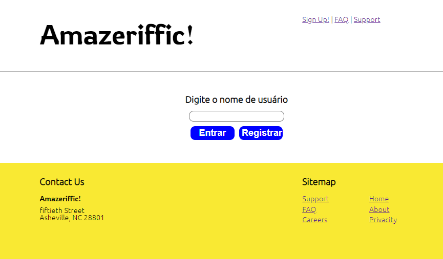
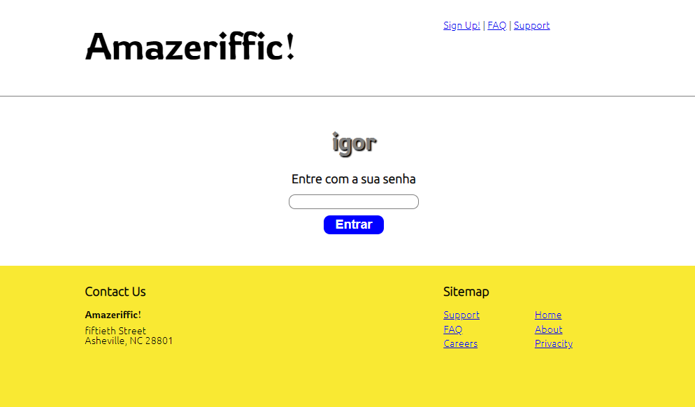
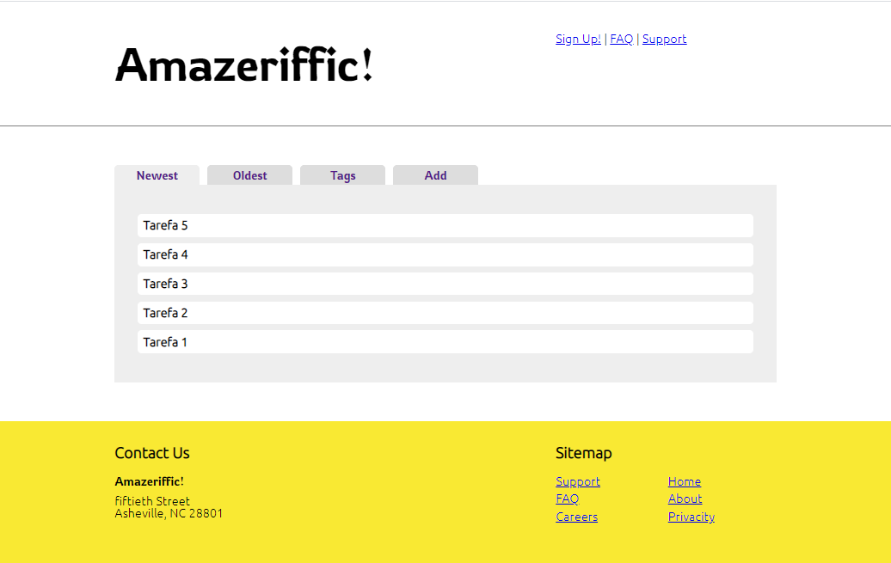
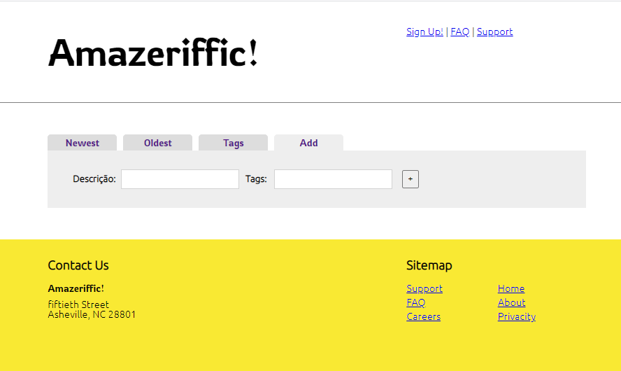

<h1 align="center">Amazeriffic</h1>

Aplicação para anotações de tarefas do livro <a href="http://learningwebappdev.com/">Aprendendo a desenvolver applicações web de Semmy Purewal</a>, com algumas modificações

<h2>Aplicação funcional, Porem desenvolvendo melhoras</h2>
<h2>Tecnologias Utilizadas</h2>
<ul>
  <li><a href="https://nodejs.org/en/">Node.js</a></li>
  <li><a href="https://developer.mozilla.org/pt-BR/docs/Web/HTML">HTML</a></li>
  <li><a href="https://developer.mozilla.org/pt-BR/docs/Web/CSS">CSS</a></li>
  <li><a href="https://developer.mozilla.org/pt-BR/docs/Web/JavaScript">JS</a></li>
  <li><a href="https://www.mongodb.com/">MongoDB</a></li>
</ul>
<h2>Modulos utilizados</h2>
<ul>
  <li><a href="https://www.npmjs.com/package/bcrypt">Bcrypt</a></li>
  <li><a href="https://www.npmjs.com/package/express">Express</a></li>
  <li><a href="https://www.npmjs.com/package/mongoose">Mongoose</a></li>
</ul>
<h2>Capturas de tela da aplicação</h2>

Entrar com Usuario

Entrar com senha

Pagina das tarefas listadas

add novas tarefas

<h2>Autor</h2>

<h3>Igor Silva</h3>

Estudante de Programação e fascinado por computação

